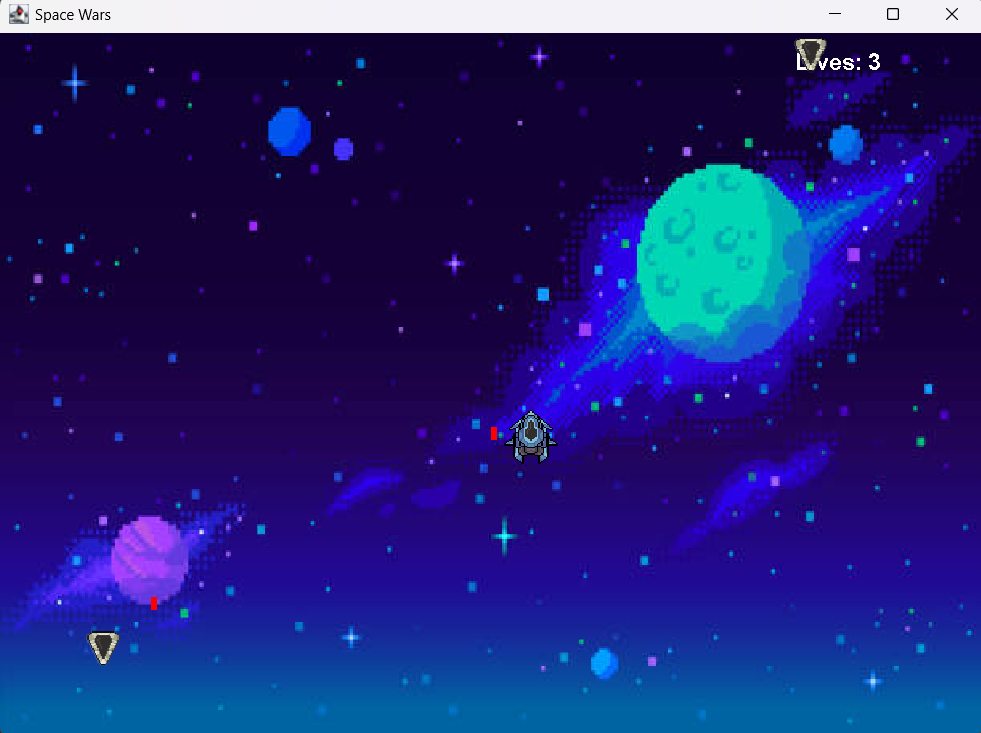
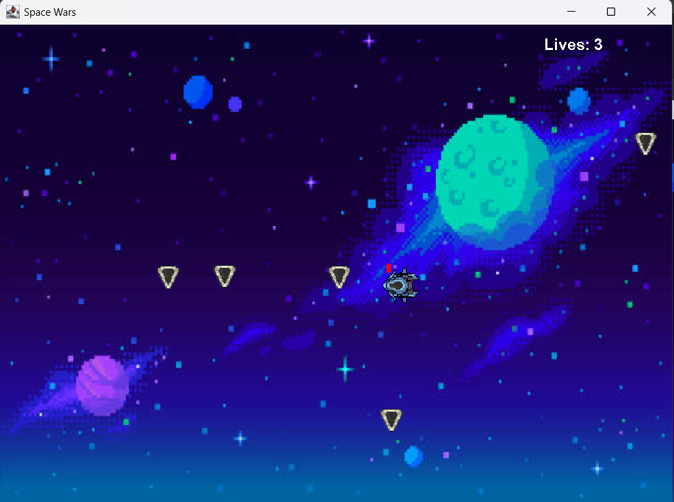
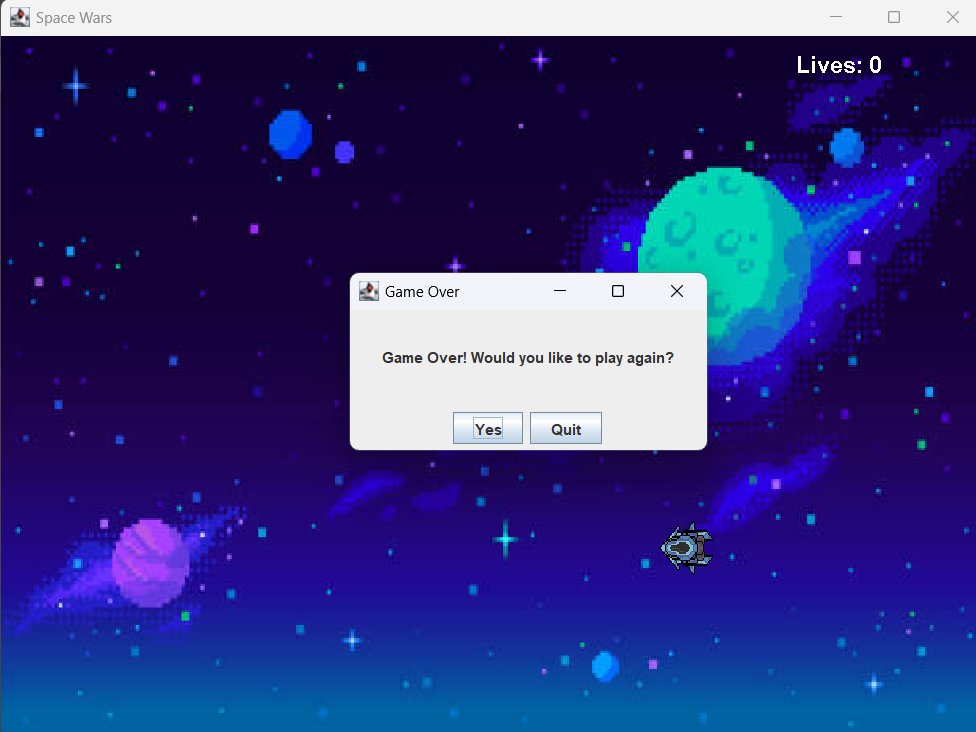

# SpaceWars
This is my version of a space wars game

### Game Logic and Design
The game is a 2D action-oriented game where the player controls a character that can move freely across the screen while trying to avoid enemies. The enemies are programmed to pursue the player and spawn at regular intervals. The player can shoot bullets automatically when they stop moving. The enemies use basic steering and seek behaviors to navigate toward the player. The game includes collision detection, enemy spawning, and bullet movement, and has an adjustable spawn interval for enemies.   
•	Player Movement: The player can move in any direction using arrow keys or WASD. 
•	Enemy Movement: Enemies use basic pursuit behavior to move toward the player. 
•	Shooting Mechanism: Bullets are automatically fired when the player stops moving, with continuous fire if the player stays still. 
•	Enemy Spawning: Enemies spawn at regular intervals that decrease over time to increase difficulty. 
•	Collision Detection: The game checks for collisions between bullets and enemies, as well as between the player and enemies. 

## Screen Shots

